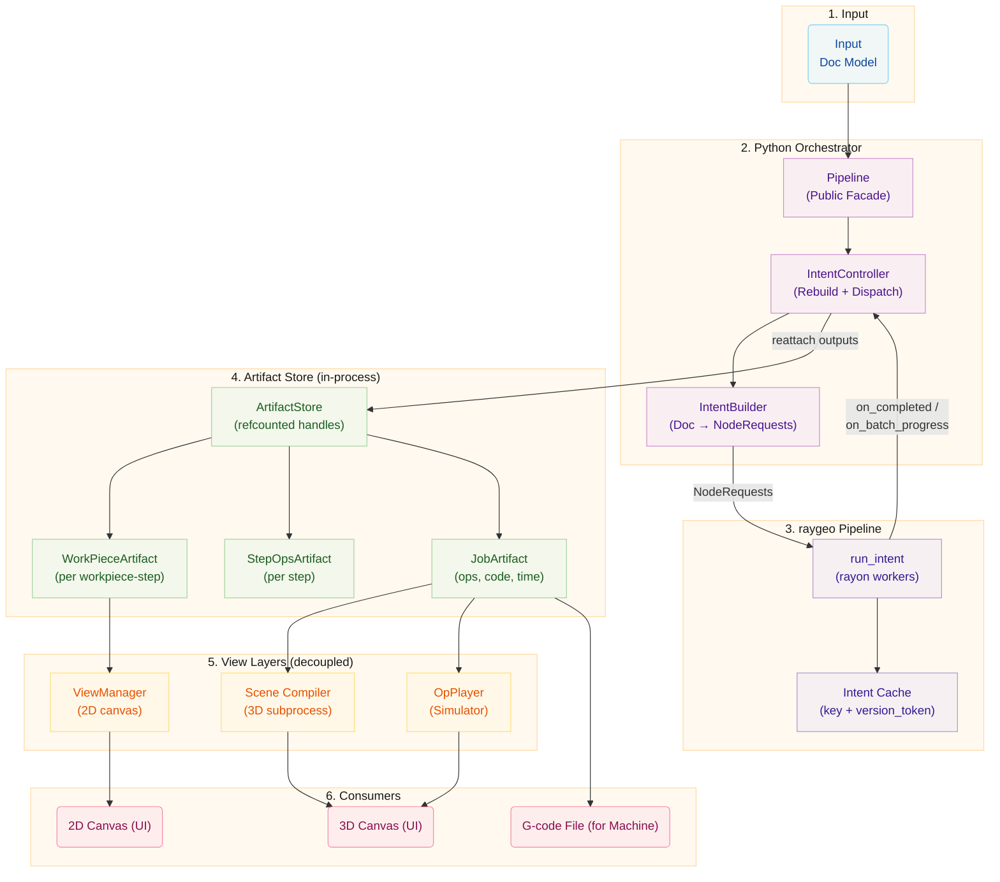

# Pipeline Architecture

This document describes the pipeline that turns a `Doc` model into
machine-executable G-code. Since the 1.9.0 rewrite the pipeline is
built on **raygeo intents**: a declarative description of the work the
Rust side should perform, coupled with a thin Python orchestration
layer and a refcounted in-process artifact store.

The previous multiprocessing DAG (`DagScheduler`, `PipelineGraph`,
`ArtifactManager`, `GenerationContext`, `WorkPiecePipelineStage`) has
been removed. This document describes the live architecture only.

# Core Concepts

## Pipeline (Public Facade)

`rayforge/pipeline/pipeline.py:40` — the class the rest of the
application talks to. `DocEditor`, `ViewManager`, UI widgets, and test
code should depend on `Pipeline` only. `IntentController` and
`IntentBuilder` are implementation details of the facade and may
change without notice.

`Pipeline` owns the `ArtifactStore` integration: it translates the raw
raygeo outputs emitted by its internal `IntentController` into
refcounted artifact handles that the UI and export paths consume, and
exposes the signal/property surface the rest of the application
expects (busy state, pause/resume, recalculate, machine changes).

Key signals relayed by the facade:

| Signal                     | Meaning                                                 |
| -------------------------- | ------------------------------------------------------- |
| `processing_state_changed` | Busy/idle transitions                                   |
| `workpiece_artifact_ready` | A `WorkPieceArtifact` handle was published              |
| `job_generation_finished`  | A `JobArtifact` handle (G-code + ops + estimates) ready |
| `job_time_updated`         | Aggregate time estimate changed during a rebuild        |
| `data_stale`               | Rebuild requested but currently paused or manual mode   |
| `visual_chunk_available`   | Progressive raster chunk for incremental UI updates     |

## IntentController

`rayforge/pipeline/intent_controller.py:108` — owns a raygeo `Intent`
and the surrounding rebuild lifecycle. It listens to the same bubbled
Doc signals the legacy pipeline used (`descendant_updated`,
`descendant_transform_changed`, `descendant_added`,
`descendant_removed`, `job_assembly_invalidated`) and rebuilds a
raygeo `Intent` whenever the document changes.

On each debounced rebuild (200 ms `REBUILD_DEBOUNCE_MS`):

1. `IntentBuilder` is called to produce a fresh list of
   `NodeRequest` objects from the current `Doc`.
2. The new list is wrapped into a raygeo `Intent` via
   `create_intent_from_nodes`.
3. `Intent.update` diffs the previous intent against the new one
   using the `version_token` per node and evicts any stale cache
   entries on the shared raygeo `Pipeline`.
4. When `dispatch=True` the new intent is also executed via
   `run_intent`; the `on_completed` callback performs the epoch filter
   (discarding results whose `generation_id` is older than the
   controller's current generation) and then marshals a DOM
   reattachment back to the application main thread via the shared
   task manager.
5. The `on_batch_progress` callback relays aggregate progress to
   listeners via `progress_changed` (marshalled onto the main thread so
   signal handlers never run on a rayon worker).

The controller`s `\_key_to_item`map (rebuilt on every successful`IntentBuilder.build`call) lets the`on_completed`epoch-filtered
callback reattach outputs onto the originating`WorkPiece`or`Step`
without re-walking the Doc. Node keys are dispatched by shape:

| Node key                        | Reattached to          | Signal emitted             |
| ------------------------------- | ---------------------- | -------------------------- |
| `workpiece:{wp_uid}:{step_uid}` | The owning `WorkPiece` | `workpiece_artifact_ready` |
| `step:{step_uid}`               | The owning `Step`      | `step_artifact_ready`      |
| `job`                           | The `Doc`              | `job_aggregate_ready`      |
| `job:encode`                    | The `Doc`              | `job_generation_finished`  |

## IntentBuilder

`rayforge/pipeline/intent_builder.py:133` — walks a `Doc` and produces
a flat list of `NodeRequest` objects with **stable keys** and
**deterministic version tokens**. The builder is stateless: each call
to `build` produces a fresh, self-contained list suitable for wrapping
in a raygeo `Intent`.

### Stable Keys

- `workpiece:{wp_uid}:{step_uid}` — one compute node per
  workpiece/step pair.
- `step:{step_uid}` — one aggregate node per step that concatenates
  the workpiece compute outputs and applies per-step transformers.
- `job` — one final aggregate node linking all step outputs with
  job-level markers and machine parameters.
- `job:machinexform` — machine-transform compute node that consumes
  the job aggregate's world-space ops and produces machine-space ops
  (curve linearization, rotary axis mapping, world&rarr;machine,
  WCS offsets, Z-flip, AXIS_REPLACEMENT).
- `job:encode` — encoder compute node that consumes the
  machine-transform node's ops and produces the machine code
  (G-code / vertex / texture).

The key formats are centralised in `intent_builder.py` so the producer
and the `IntentController` reattachment map always agree.

### Version Tokens

raygeo's cache is keyed by node key only; the `version_token` is the
sole invalidation signal. Tokens are SHA-1 digests of a canonical
representation of the inputs that affect a node's output (see
`_hash_int`, `intent_builder.py:1066`):

- **Compute tokens** hash
  `(geometry_revision, wp_size, step_params, assembler_params,
per_workpiece_transformers)`. For step scopes declaring a
  position-sensitive transformer (see `Step.is_position_sensitive`),
  `transform_revision` of the workpiece and the stock revision are
  folded into the token; otherwise they are omitted so pure moves do
  not invalidate workpiece compute results.
- **Step aggregate tokens** hash
  `(upstream compute tokens, placements, step_params,
per_step/per_workpiece transformers, position_sensitive())`, plus
  `stock_rev` when the step is position-sensitive.
- **Job token** folds in all per-step aggregate tokens so any upstream
  change (workpiece move, transformer edit, step param change)
  propagates through to the job/encode cache.
- **Machine-transform token** folds in the job token plus the machine
  identity (`supports_curves`, `reverse_z_axis`, WCS config, rotary
  module config per layer).
- **Encode token** folds in the machine-transform token plus the
  encoder identity (`driver_name`, `gcode_precision`, axis extents,
  ...).

### Stage Construction

Each `NodeRequest` carries a `StageSpec` describing the work raygeo
should perform for that node. The builder produces:

- `StageSpec.Compute` for every workpiece/step pair via
  `Step.build_compute_payload(machine_defaults, workpiece)`, which
  returns a `Part` (vector geometry or image source) plus a
  `ComputePayload` (assembler spec and stable workpiece UID). Assemblers
  use that UID on explicit `VectorOutline` and `RasterFill` section
  markers, which gives path-interruption transforms and binary backends a
  structural boundary that survives aggregation. Per-workpiece transformers
  (`OverscanTransformer`, `BidirScanOffsetTransformer`, ...) are
  resolved via `transformer_registry` into typed Rust `*Spec` pyclasses
  and attached to the payload so the Rust compute stage applies them
  after assembly.
- `StageSpec.Aggregate` for every step: one `AggregateGroup` per
  upstream workpiece compute node, wrapped by `WorkpieceStart` /
  `WorkpieceEnd` markers, with each input carrying the workpiece's
  world placement matrix and physical size as `target_dimensions`.
  Per-step transformers (`MultiPassTransformer`, `Optimize`, ...) are
  attached to `AggregateSpec.transformers` so the Rust aggregate
  stage applies them after concatenation. `MachineParams` is populated
  from the resolved machine so the aggregate's time estimate is
  correct.
- `StageSpec.Aggregate` for the `job` node: one `AggregateGroup` per
  layer wrapped by `LayerStart` / `LayerEnd` markers, each containing
  one `AggregateInput` per visible step; the whole aggregate is
  wrapped by `JobStart` / `JobEnd`.
- `MachineTransformSpec` for `job:machinexform`: the world&rarr;machine
  4&times;4 matrix, default and per-layer WCS offsets, per-layer
  `RotaryMappingSpec` entries, curve-linearization flag, and Z-reverse
  flag, packaged into a serialisable spec that the Rust
  `MachineTransformCompute` stage consumes.
- `EncodeSpec` for `job:encode`: routes Grbl machines to the native
  Rust `GcodeSpec` (compiled directly on a rayon thread without
  crossing the GIL) and every other machine to a `PythonEncoder`
  wrapping the driver-specific encoder callable. The encoder reads
  machine-space ops from the upstream `job:machinexform` node.

### Binary program backends

`EncodedOutput` can carry an opaque `payload` in addition to its
human-readable text and operation map. The Ruida backend uses this contract
for a complete `.rd` program; transport framing is not stored in the pipeline
artifact.

For Ruida jobs, each resolved step is enclosed by `ProcessStart` and
`ProcessEnd` markers. `ProcessStart` contains a version 1 process document
with the process kind, speeds, power model, air assist, head identity, raster
strategy, and source identity needed by a binary backend. These markers
survive aggregation and the world-to-machine transform, so `RuidaEncoder`
receives final machine-space `Ops` without depending on the document model.
Raster angle and axis fields describe source-space planning intent; geometric
transforms update the scan motion rather than rewriting process metadata. A
binary backend therefore resolves its effective scan axis from the quantized
machine-space motion while using the metadata to validate strategy and
cross-hatch intent.

`RuidaEncoder` lowers those operations into the neutral `JobPlan` API from
`ruida-re`. The library validates the evidenced Ruida feature set and compiles
the plan into a complete checksummed `.rd` payload. The USB serial and UDP
program drivers decode that payload back into the lossless `ruida-re`
`Program` representation before transfer. Unknown commands, noncanonical
payloads, and unsupported process features fail before controller I/O.

The program drivers deliberately do not expose Ruida device management or
execution control. Successful return from `run()` means transfer completed;
it does not mean the controller finished executing the job.

### Stock Resolution

`_resolve_stock_geometries` (called once per `build` and cached on the
builder) returns the world-space stock boundary geometries that
transformers such as `CropTransformer` use to clip per-workpiece ops
to the machine's work area or explicit `StockItem`s. Doc-owned
`StockItem` entries take precedence; the machine workarea rectangle is
used as a fallback only when no doc stock exists.

## raygeo Pipeline & `run_intent`

raygeo's `Pipeline` (`raygeo.pipeline.execute.Pipeline`) owns the
cache that `Intent.update` invalidates. `run_intent` schedules the
intent's nodes onto rayon worker threads under the GIL and invokes
the `on_completed` callback per node and `on_batch_progress` for
aggregate progress. Heavy work (compute, raster, aggregate, machine
transforms, encoding) runs in raygeo threads instead of subprocesses,
which is the headline change called out in CHANGELOG 1.9.0.

## ArtifactStore & Artifact Handles

The legacy shared-memory `ArtifactStore` has been replaced by an
in-process, refcounted store
(`rayforge/pipeline/artifact/store.py:29`). All artifacts live as
plain Python objects in a dict keyed by a UUID; handles carry the UUID
in their `key` field plus any metadata the artifact type needs.
Lifecycle is managed through reference counting via
`ArtifactStore.retain` / `release`.

The `Pipeline` facade translates raygeo outputs into artifact handles
on the main thread:

| Output (raygeo)         | Artifact            | Stored under tag |
| ----------------------- | ------------------- | ---------------- |
| Per workpiece-step ops  | `WorkPieceArtifact` | `wp`             |
| Per step aggregated ops | `StepOpsArtifact`   | `step`           |
| Job aggregate + encode  | `JobArtifact`       | `job`            |

`JobArtifact` carries the world-space `Ops`, total distance, time
estimate, the `EncodedOutput` (text, op&rarr;machine-code map, and optional
opaque payload),
and — when rotary modules are configured — kinematically-mapped ops
for the 3D preview.

## Generation IDs & Epoch Filtering

Each rebuild increments `IntentController.generation_id`. Every
completed node carries the generation it was spawned from. The
`on_completed` callback compares the node's `generation_id` against
the controller's current generation and silently discards superseded
results, so stale outputs from a previous rebuild are never reattached
to the DOM.

## Pause, Resume & Manual Mode

- `Pipeline.pause()` / `resume()` increment/decrement a pause counter
  on the controller. While paused, doc changes set a `data_stale` flag
  (and emit `data_stale`) instead of scheduling a rebuild; on resume
  the flag is cleared and a rebuild is scheduled if `auto_rebuild` is
  enabled.
- `Pipeline.auto_pipeline=False` (manual mode): recalculation is
  triggered explicitly via `Pipeline.recalculate()` rather than
  automatically on every doc change.

## Invalidation Strategy

Invalidation is implicit and token-driven: any change that affects a
node's inputs causes the builder to produce a different `version_token`
for that node's key. `Intent.update` evicts the stale cache entry and
raygeo re-executes only that node (and its downstream consumers).

| Change Type                     | Effect on Tokens                                                                                                                                                                                |
| ------------------------------- | ----------------------------------------------------------------------------------------------------------------------------------------------------------------------------------------------- |
| Geometry / params               | New workpiece compute tokens cascade to step, job, machinexform, encode                                                                                                                         |
| Position / rotation             | Workpiece compute tokens unchanged unless step is position-sensitive; step aggregate tokens always change due to folded placements, which cascades to job/encode                                |
| Size change                     | Same as geometry: tokens cascade from workpiece-step pairs upward                                                                                                                               |
| Stock items visible/moved/added | Affects `stock_rev` (folded into compute & aggregate tokens of position-sensitive steps)                                                                                                        |
| Machine config                  | All of `job:machinexform` and `job:encode` tokens change; step compute/aggregate tokens change if `kerf_mm` / `cut_speed` / laser head / arc tolerance / supports_curves / supports_arcs change |

# Detailed Breakdown

## Input

The process begins with the **Doc Model**, which contains:

- **WorkPieces:** Individual design elements (SVGs, images) placed on
  the canvas
- **Steps:** Processing instructions (Contour, Raster, etc.) with
  settings, organised into a per-layer `Workflow`
- **Layers:** Grouping of workpieces, each with its own workflow, WCS
  and rotary config
- **StockItems:** Optional explicit stock boundaries used by
  position-sensitive transformers (e.g. CropTransformer)

## Python Orchestrator

### Pipeline (Facade)

The `Pipeline` class:

- Listens to the Doc model for changes via signals (relayed through
  the `IntentController`)
- **Debounces** changes (200 ms reconciliation delay)
- Coordinates with the `IntentController` to trigger regeneration
- Manages the overall processing state and busy detection
- Supports **pause/resume** for batch operations
- Supports **manual mode** (`auto_pipeline=False`) where
  recalculation is triggered explicitly
- Connects signals between components and relays them to consumers
- Publishes refcounted artifact handles into the `ArtifactStore`

### IntentController

The `IntentController`:

- Owns a raygeo `Intent` and the surrounding rebuild lifecycle
- Rebuilds a fresh intent on every debounced doc change
- Executes the intent via `run_intent` when `dispatch=True`
- Filters superseded results by `generation_id` (epoch filter)
- Marshals DOM reattachments onto the main thread via the shared task
  manager

### IntentBuilder

The `IntentBuilder` is stateless; each `build` call walks the `Doc`
and produces one `NodeRequest` per workpiece/step pair, one aggregate
per step, and the `job`, `job:machinexform`, and `job:encode` nodes.
See [Stable Keys](#stable-keys), [Version Tokens](#version-tokens),
and [Stage Construction](#stage-construction) above.

## raygeo Pipeline

`run_intent` schedules node execution on rayon worker threads under
the GIL. The shared `RaygeoPipeline` instance holds the node cache
keyed by node key; `Intent.update` is the sole invalidation entry
point. Compute, raster, shrinkwrap, wavefront, contour, view
rendering, and machine-transform/encoding all run in raygeo threads.

## Artifact Generation

### WorkPieceArtifacts

Generated for each `(WorkPiece, Step)` combination. Contains:

- Toolpaths (`Ops`) in the workpiece's local coordinate system
- Scalability flag and source dimensions for resolution-independent ops
- Generation ID

Large raster workpieces are processed incrementally in chunks
(relayed through `visual_chunk_available`), enabling progressive
visual feedback during generation.

### StepOpsArtifacts

Generated for each Step, consuming all related WorkPieceArtifacts:

- Combined `Ops` for all workpieces in world-space coordinates
- Per-step transformers applied (`Optimize`, `MultiPass`, ...)

### JobArtifact

Generated when G-code is needed, consuming the `job` aggregate and the
`job:encode` node:

- Final machine code (G-code or driver-specific format) via
  `EncodedOutput` (text, op&rarr;machine-code map, and optional opaque payload)
- World-space `Ops` for simulation and playback
- High-fidelity time estimate and total distance
- Rotary-mapped ops for 3D preview when rotary modules are configured

## 2D View Layer (Decoupled)

The `ViewManager` is decoupled from the data pipeline. It handles
rendering for the 2D canvas based on UI state.

### RenderContext

Contains the current view parameters (pixels per millimetre, viewport
offset, display options).

### WorkPieceViewArtifacts

The `ViewManager` creates `WorkPieceViewArtifacts` that rasterize
`WorkPieceArtifacts` to screen space, apply the current
`RenderContext`, and are cached and updated when context or source
changes. Re-rendering is throttled (33 ms interval) and concurrency-
limited; progressive chunk stitching provides incremental visual
updates. The `ViewManager` indexes views by
`(workpiece_uid, step_uid)` to support visualizing intermediate
states of a workpiece across multiple steps.

## 3D / Simulator Layer (Decoupled)

The 3D visualization and simulation system is decoupled from the data
pipeline, following a similar pattern to the `ViewManager`. It
consists of:

- A **Scene Compiler** that runs in a subprocess to convert
  `JobArtifact` ops into GPU-ready vertex data
- An **OpPlayer** that replays the job's ops for real-time machine
  simulation with playback controls

Both consume the `JobArtifact` produced by the pipeline.

### CompiledSceneArtifact

The Scene Compiler produces a `CompiledSceneArtifact` containing:

- **Vertex layers:** Powered/travel/zero-power vertex buffers with
  per-command offsets for progressive reveal
- **Texture layers:** Rasterized scanline power maps for engraving
  preview
- **Overlay layers:** Scanline power segments for real-time highlight
- Support for rotary (cylinder-wrapped) geometry

### Compilation Pipeline

1. Canvas3D listens for `job_generation_finished` signals
2. When a new job is ready, it schedules scene compilation in a
   subprocess
3. The subprocess reads the `JobArtifact` from the store and compiles
   ops into GPU vertex data
4. The compiled scene is adopted back and uploaded to GPU renderers

### OpPlayer (Simulator Backend)

The `OpPlayer` walks through the job's ops command-by-command,
maintaining a `MachineState` that tracks position, laser state, and
auxiliary axes. This drives the 3D canvas playback (progressive reveal
of the toolpath), the machine head position and laser beam
visualization, and per-command stepping for the playback slider.

## Consumers

| Consumer  | Uses                       | Purpose                              |
| --------- | -------------------------- | ------------------------------------ |
| 2D Canvas | WorkPieceViewArtifacts     | Renders workpieces in screen space   |
| 3D Canvas | CompiledSceneArtifact      | Renders full job in 3D with playback |
| Machine   | JobArtifact (machine code) | Manufacturing output                 |

# Key Architectural Decisions

1. **Intent-based Scheduling:** Instead of an explicit Python DAG with
   Python-resident schedulers, the pipeline declares _what_ to compute
   (an `Intent` of `NodeRequest`s with stable keys and version tokens)
   and lets raygeo's `run_intent` schedule the work on rayon threads.
   Cache invalidation is purely token-driven via `Intent.update`.

2. **Facade + Internal Controller:** `Pipeline` is the single public
   surface; `IntentController` and `IntentBuilder` are implementation
   details. This keeps the public signal/property contract stable
   while allowing the orchestration internals to evolve.

3. **In-Process Artifact Store:** Replacing the multiprocessing
   shared-memory store with a refcounted in-process dict removes the
   IPC and ownership-handoff complexity while keeping the
   handle/lifecycle contract the UI and export paths rely on.

4. **Generation IDs:** Each rebuild increments a generation ID; every
   completed node carries its spawn generation. The `on_completed`
   epoch filter silently discards superseded results, so stale outputs
   are never reattached to the DOM.

5. **Main-Thread Reattachment:** raygeo callbacks (`on_completed`,
   `on_batch_progress`) fire on rayon worker threads under the GIL;
   the controller marshals every DOM-touching callback onto the
   application main thread via the shared task manager, so signal
   handlers never run on a worker.

6. **View Layer Separation:** Both the 2D canvas (`ViewManager`) and
   3D canvas (Scene Compiler / OpPlayer) are decoupled from the data
   pipeline. Each is driven by pipeline signals rather than being part
   of the intent.

7. **Token-Driven Invalidation:** There is no explicit invalidation
   table. The builder produces canonical SHA-1 version tokens; any
   input change produces a different token, which `Intent.update`
   uses to evict exactly the affected cache entries.

8. **Debounced Reconciliation:** Doc changes are batched with a 200 ms
   debounce (`REBUILD_DEBOUNCE_MS`) to avoid excessive pipeline cycles
   during rapid edits.
